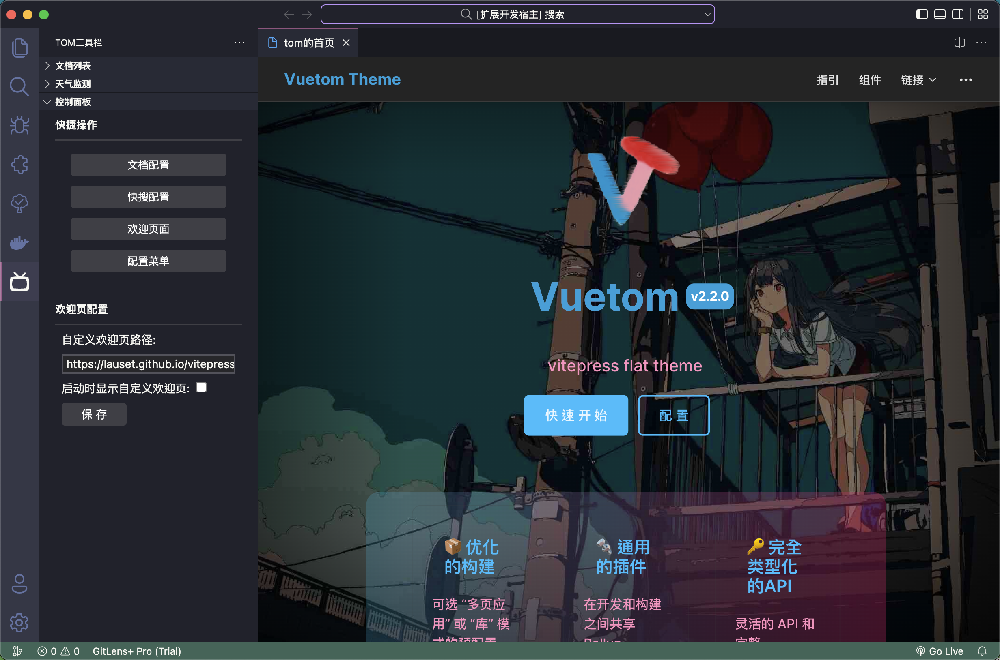
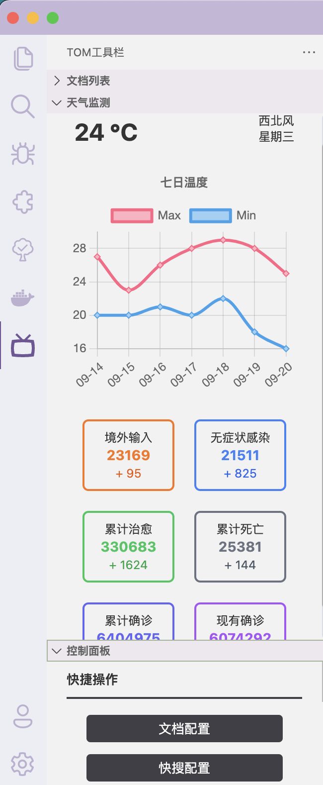
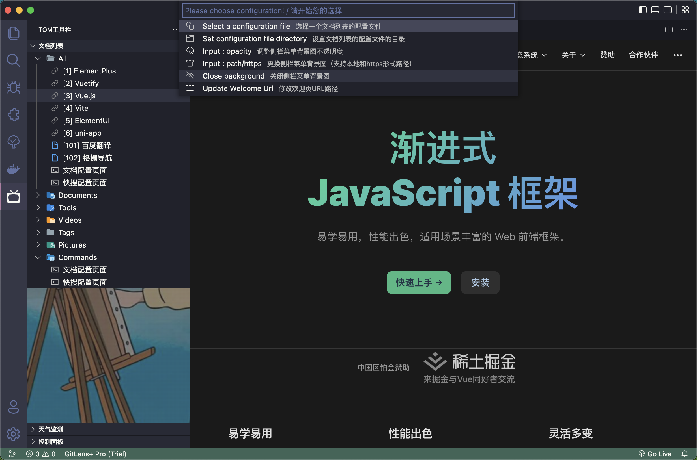
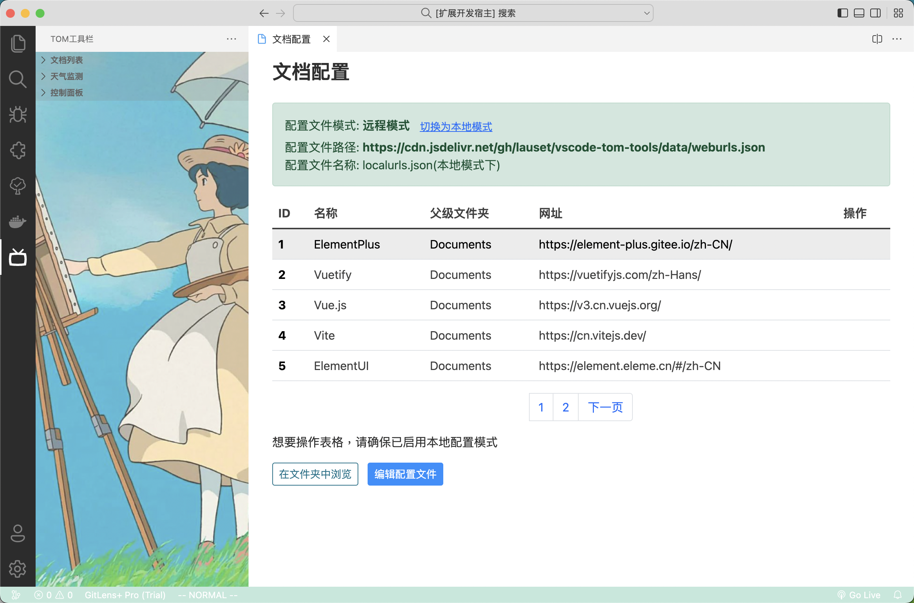
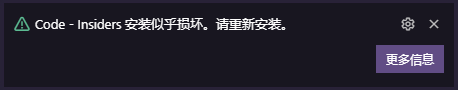

# Tom Tools

<p align="center">
  
</p>

一款包含多种功能（文档查看、天气疫情监控、快捷搜索）的工具插件，就工具插件呗

插件名称: `Tom Tools`

插件标识: `tomtools`

命令标识: `tt`

> 更新 1.2 版本前如果使用了文档本地配置请务必备份本地配置文件

<br/>

## 功能一览

目前大的功能块分为三大类

- 自定义首页：
  - 配置自定义首页链接
  - 启动时展示自定义首页
  - 可编辑的首页，真·自定义（待开发）

- 文档查看功能：
  - 配置文档列表数据
  - 侧栏菜单快速打开文档

- 快速搜索功能：
  - 配置搜索链接
  - 右键菜单快速搜索将打开浏览器

- 侧栏工具菜单
  - 文档列表
  - 天气与疫情监控
  - 快捷命令选项

<p align="center">
  
</p>

<p align="center">
  
</p>

<p align="center">
  
</p>

<p align="center">
  
</p>

<br/>

## 快速开始

**注意事项**

<p align="center">
  
</p>

VSCode 会进行后台检测磁盘上的样式之类的文件是否已更改，更改了样式后插件会有一下提示 **安装似乎已损坏** ，不再提示即可

<br>

### 命令与配置

<br>

>**命令说明**

可以 `ctrl+shift+p` 键入以下命令，也可通过侧栏菜单快速点击完成操作

| 命令| 执行方式 | 说明 |
|-|-|-|
| tt.so | 选中文本右键快速搜索 | 打开浏览器并根据自定义网链搜索内容 |
| tt.welcome | 命令执行/侧栏菜单 | 打开自定义欢迎页面 |
| tt.doc | 命令执行/侧栏菜单 | 打开文档配置页面 |
| tt.search | 命令执行/侧栏菜单 | 打开快搜配置页面 |
| tt.menu | 命令执行/侧栏菜单 | 显示配置下拉菜单，可视化方式设置配置文件路径以及侧栏背景图 |
| tt.show | 命令执行/JS文件中右键菜单 | 目前没什么用 |
| tt.path | 命令执行/文件中右键菜单 | 展示当前文件路径，可在文件夹中打开 |

>**配置项说明**

全局配置项

"tomtools.owner": 您在该插件中的称呼，默认为 `tom`

"tomtools.welcome": 启动时是否显示插件自定义的欢迎页面，默认为 `false`

"tomtools.welcome.url": 自定义欢迎页面路径，可定为一些网络链接

```json
{
  "tomtools.owner": "tom",
  "tomtools.welcome": false,
  "tomtools.welcome.url": "https://cn.vuejs.org"
}
```

侧栏背景图配置项

"tomtools.image.enabled": 开启侧边栏背景图片

"tomtools.image.opacity": 背景图片透明度 `0-1` 默认 `0.2`

"tomtools.image.path": 背景图片路径，支持本地或网链

```json
{
  "tomtools.image.enabled": true,
  "tomtools.image.opacity": 0.5,
  "tomtools.image.path": "C:\\Users\\tom\\Desktop\\bg1.png"
}
```

文档列表配置项

"tomtools.urls.enabled": 开启本地化配置

"tomtools.urls.path": 本地配置文件路径

"tomtools.urls.file": 本地配置文件名称

```json
{
  "tomtools.urls.enabled": true,
  "tomtools.urls.path": "d:\\Code\\VScodeProjects\\plug-in\\tomhub-tools-plugin\\data",
  "tomtools.urls.file": "localurls.json"
}
```

快速搜索配置项

"tomtools.search.enabled": 开启快搜本地配置

"tomtools.search.path": 本地配置文件路径

"tomtools.search.file": 本地配置文件名称

"tomtools.search.url": 快速搜索使用的网链

```json
{
  "tomtools.urls.enabled": true,
  "tomtools.urls.path": "/Users/tom/Code/VscodeProjects/vscode-tom-tools/data",
  "tomtools.search.file": "localsearch.json",
  "tomtools.search.url": "https://www.baidu.com/s?wd=%s"
}
```

<br>

### 功能操作说明

<br>

>**侧边栏菜单说明**

  安装插件后会在左侧视图菜单中出现 `Tom工具栏` 这一项菜单，图标是个电视机

  容器中会存在三个菜单（文档列表、天气监控、控制面板）

  【文档列表】：展示远程文档配置文件中的文档列表（可以是文档也可以配置自定义命令）

  【天气监控】：展示实时天气情况，实时疫情统计，未来7天气温

  【控制面板】：提供了一些方便操作的命令按钮

<br>

>**文档列表数据格式**

文档列表中的数据目前储存在远程仓库 `根目录/data` 目录下的 `weburls.josn` 文件中，默认会使用远程仓库的数据。

单个网链数据结构如下

```javascript
interface IUrl {
  isUrl: boolean; // 默认true，是否是有效网链
  isCmd: boolean; // 是否是命令
  state: number; // 链接状态，暂无用处
  id: string; // 链接ID，不可重复，可用于排序
  name: string; // 链接名称
  url: string; // 链接地址
  type: string; // 链接类型，也就是所属的父级菜单名称
  tags: string[]; // 链接标签
}
```

配置示例：

文档网链示例：

```json
{
  "id": "3",
  "isUrl": true,
  "state": 3,
  "name": "Vue.js",
  "url": "https://cn.vuejs.org/",
  "type": "Documents",
  "tags": ["framework", "vue"]
}
```

操作命令示例：

```json
{
  "id": "1001",
  "isCmd": true,
  "state": 3,
  "name": "文档配置页面",
  "url": "tt.doc",
  "type": "Commands",
  "tags": ["cmd"]
}
```

<br>

>**快速搜索数据格式**

```js
interface ISearch {
  id: number
  isDefault: boolean
  enabled: boolean
  name: string
  desc: string
  url: string
  icon: string
}
```

```js
const defaultSearch: ISearch = {
  "id": 2,
  "isDefault": false,
  "enabled": false,
  "name": "谷歌",
  "desc": "Google",
  "url": "https://www.google.com/search?q=%s",
  "icon": ""
}
```

<br>

>**本地化配置文件**

默认使用远程仓库的 json 文件作为文档列表的数据来源，可以设置为本地文件并可以自定义设置本地配置文件路径和名称

请启用该功能，否则更新插件后插件根目录内的本地配置会被覆盖，请将常用配置移至个人电脑文档目录

操作方法：

用户要先设置 `tomtools.urls.enabled: true` 来启用本地化的配置。然后需要指定你本地配置文件的**路径**和**名称**，默认本地配置文件名称为 `localurls.json`，你可以将远程 `weburls.json` 中的数据复制到你本地配置文件中。同时也可以通过侧栏菜单按钮 `文档配置` 进入文档配置页面进行操作，注意要刷新左侧文档列表

<br>

>**下拉命令菜单**

可以输入命令 `tt.menu` 来打开功能下拉菜单

- 从文件资源管理器直接选择配置文件（选择后可选择打开并编辑配置，是的，编辑完你肯定需要重启）
- 从文件资源管理器选择配置文件夹，然后选择该文件夹内的配置文件
- 输入侧栏菜单背景图的路径（可以是本地图片的路径，也可以https网络路径）
- 输入侧栏菜单背景图的透明度（0的时候图片最明显，1的话就显示不出来图片了）
- 关闭侧栏菜单的背景图功能

<br>

## 远程仓库

> - 远程仓库使用 github 并同时使用 gitee 进行代码同步
> - 远程仓库地址 [vscode-tom-tools](https://github.com/lauset/vscode-tom-tool)

<br/>

## 问题意见

插件的使用过程中如果发现了任何的 `bug` 或者有任何建议, 请提交 issues to GitHub Repo [issues](https://github.com/lauset/vscode-tom-tools/issues)

<br/>

## 插件开发

>**目录说明**

- config 本地配置文件存放目录
- data 远程配置文件存放目录
- libs 三方依赖库
- resources 图标文件
- src 源码目录
  - apis
  - commands 命令注册（视图命令、普通命令）
  - common 公共模块（全局事件、枚举）
  - menus 侧栏菜单列表（列表与渲染，视图继承）
  - select 下拉菜单（菜单配置项与样式修改）
  - utils 工具类（日志、消息通知、视图回调、needle请求）
- webviews 视图界面（可使 Js 或 VueJS 完成页面开发）

>**安装依赖**

```sh
npm install
```

>**运行插件**

可使用 VScode 运行和调试功能

监听文件变动：`Dev Extension`

运行：`Run Extension`

这将会附带执行 TS 编译任务

```sh
npm run compile
```

>**打包部署**

可全局安装 `vsce` 或作为 Dev 依赖

~~pnpm 下操作~~ 待官方修复依赖问题

```sh
# 已过时: npm install -g vsce
# nmp i -D @vscode/vsce
npm install --global @vscode/vsce --force

vsce --version
```

指定平台打包

```sh
vsce package --target win32-x64
```

全平台打包

```sh
# 打包操作
vsce package

vsce package --no-dependencies
```

插件打包：生成 `vsix` 文件，部署该文件或者将其作为离线插件安装并使用

>**常用网址**

在 [https://marketplace.visualstudio.com/](https://marketplace.visualstudio.com/) 网站发布插件

在 [https://code.visualstudio.com/api](https://code.visualstudio.com/api) 看插件开发文档
