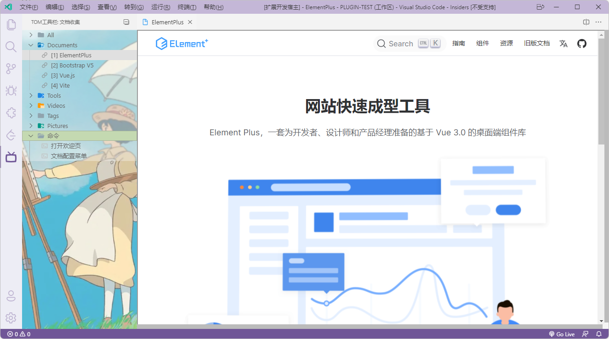
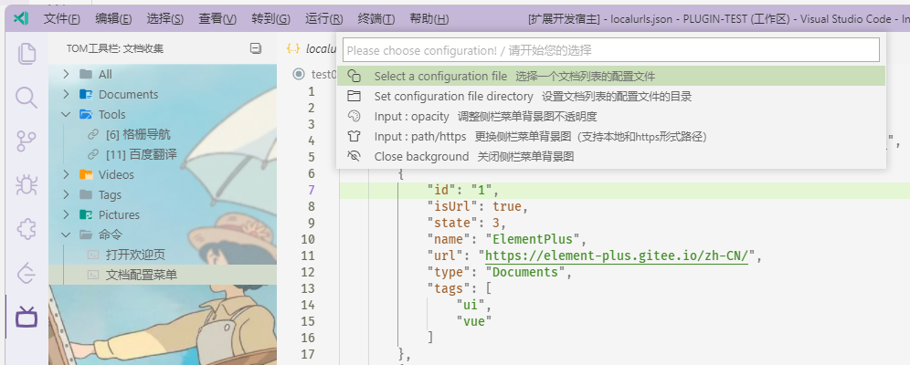
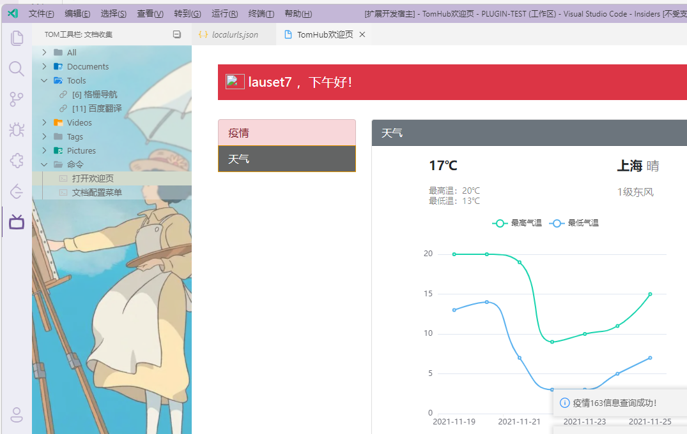
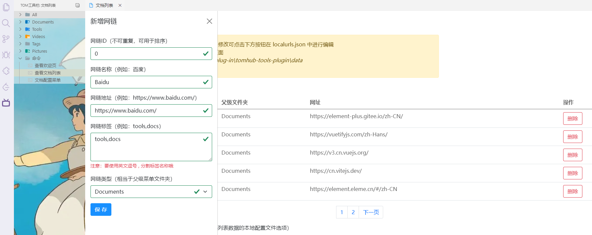
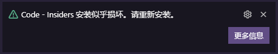

# Tom Tools

<p align="center">
  
</p>

一款包含多种功能的工具插件，就工具插件呗。

未来的路还有很长，以后日子会越来越好，让我们拭目以待吧！

<br/>

## 功能一览

目前大的功能块分为两大类

 - 自定义首页：首页会简单的展示疫情统计和天气情况
   - 疫情实时数据
   - 七日气温数据
   - 可编辑的首页，真·自定义（待开发）
   - ...

 - 侧栏工具菜单：展示各种文档的网链列表，命令列表
   - 查看开发文档，方便快速查看文档
   - 快捷命令选项，更方便更快捷地操作对应的插件命令
   - 疫情与天气历史记录（待开发）
   - 自定义命令列表（待开发）

<p align="center">
  
</p>

<p align="center">
  
</p>

<p align="center">
  
</p>

<p align="center">
  
</p>

<br/>

## 快速开始

**注意事项**

<p align="center">
  
</p>

VSCode 会进行后台检测磁盘上的样式之类的文件是否已更改，更改了样式之类的插件都会有一下提示 **安装似乎已损坏** ，不再提示即可

<br>

>**命令与配置项说明**

可以 `ctrl+shift+p` 键入以下命令，当然，之后会把所有的命令作为可点击选项，这样子就方便操作啦

简单命令

  - tt.hello: 测试插件是否正常运行

  - tt.welcome: 显示自定义欢迎页面

  - tt.menuShow: JS中会出现的右键菜单命令，目前没什么用

  - tt.getFilePath: 获取文件路径，建议在打开的文件中右键菜单获取，防止路径为空

功能性命令

  - tt.weather: 显示文档列表，可进行编辑与本地存储

  - tt.configShow: 显示配置下拉菜单，可视化方式设置配置文件以及侧栏背景图

配置项说明

"tomtools.owner": 您在该插件中的称呼，默认为 tom

"tomtools.welcome": 启动时是否显示插件自定义的欢迎页面，默认为 true

```json
{
  "tomtools.owner": "lauset7",
  "tomtools.welcome": false
}
```

<br>

>**侧边栏菜单**

  安装插件后会在左侧视图菜单中出现 `Tom工具栏` 这一项菜单

  工具栏中会按照一些文档的分类作为文件夹并列出网链列表，点击即可在 vscode 右侧视图中打开该网链

  还有一个 **命令** 这一文件夹，里面提供的一些菜单可以代替一些命令的输入


<br>

>**文档列表数据**

文档列表中的数据目前储存在远程仓库 `根目录/data` 目录下的 `weburls.josn` 文件中，默认会使用远程仓库的数据。

单个网链数据项包含的字段说明如下

```javascript
interface IProblem {
  isUrl: boolean; // 默认true
  state: number; // 链接状态，默认为3即可
  id: string; // 链接ID，不重复即可，用于排序
  name: string; // 链接名称
  url: string; // 链接地址，url网链
  type: string; // 链接类型，也就是所属的父级菜单名称
  tags: string[]; // 链接标签
}
```

<br>

>**本地化配置文件**

有关的配置项如下：

开启本地化配置："tomtools.urls.enabled"

本地配置文件路径："tomtools.urls.path"

本地配置文件名称："tomtools.urls.file"

```
{
  "tomtools.urls.enabled": true,
  "tomtools.urls.path": "d:\\Code\\VScodeProjects\\plug-in\\tomhub-tools-plugin\\data",
  "tomtools.urls.file": "localurls.json"
}
```

操作方法：

用户要先设置 `tomtools.urls.enabled: true` 来启用本地化的配置，然后需要指定你本地配置文件的**路径**和**名称**，默认本地配置文件名称为 `localurls.json`，你可以将远程 `weburls.json` 中的数据复制到你配置文件中，这样就可以使用了。同时也可以通过侧边栏命令菜单 `查看文档列表` 进入文档列表页面，然后对你的本地配置文件进行编辑，保存后 **重启软件** 即可刷新左侧文档列表

网链新增与删除：

用户只需要在文档列表页面点击新增与删除按钮即可，新增时ID不可以重复

<br>

>**侧边栏命令菜单**

可以在侧边栏 `命令` 文件夹中选择 `文档配置菜单` 用来打开功能下拉菜单

下拉菜单可选择以下操作

- 从文件资源管理器直接选择配置文件（选择后可选择打开并编辑配置，是的，编辑完你肯定需要重启）
- 从文件资源管理器选择配置文件夹，然后选择该文件夹内的配置文件
- 输入侧栏菜单背景图的路径（可以是本地图片的路径，也可以https网络路径）
- 输入侧栏菜单背景图的透明度（0的时候图片最明显，1的话就没图片了）
- 关闭侧栏菜单的背景图功能

<br>

>**侧边栏菜单背景图片**

有关的配置项如下：

开启侧边栏背景图片："tomtools.image.enabled"

背景图片透明度："tomtools.image.opacity"

背景图片路径："tomtools.image.path"

```
{
  "tomtools.image.enabled": true,
  "tomtools.image.opacity": 0.5,
  "tomtools.image.path": "C:\\Users\\liuji\\Desktop\\bg001.png"
}
```

<br/>

## 远程仓库

> - 远程仓库通过 gitee 维护，每周会更新一些新的内容
> - 远程仓库地址 [vscode-tom-tools](https://github.com/lauset/vscode-tom-tools/issues)

<br/>

## 问题意见

插件的使用过程中如果发现了任何的 `bug` 或者有任何建议, 请提交 issues to 到 GitHub Repo [issues](https://github.com/lauset/vscode-tom-tools/issues)

<br/>

## 插件开发

>**运行插件**

可使用 VScode 运行和调试功能 `Run Extension`

附带执行 TS 编译任务

```javascript
npm run compile
```

>**打包部署**

需要先全局安装 `vsce`

```javascript
npm install -g vsce
```

插件打包：生成 `vsix` 文件

```javascript
vsce package --target win32-x64
```

>**网址发布**

在 [https://marketplace.visualstudio.com/](https://marketplace.visualstudio.com/) 网站发布插件

在 [https://code.visualstudio.com/api](https://code.visualstudio.com/api) 看插件开发文档
